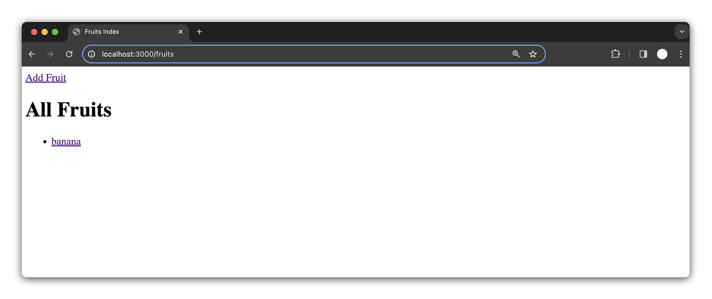
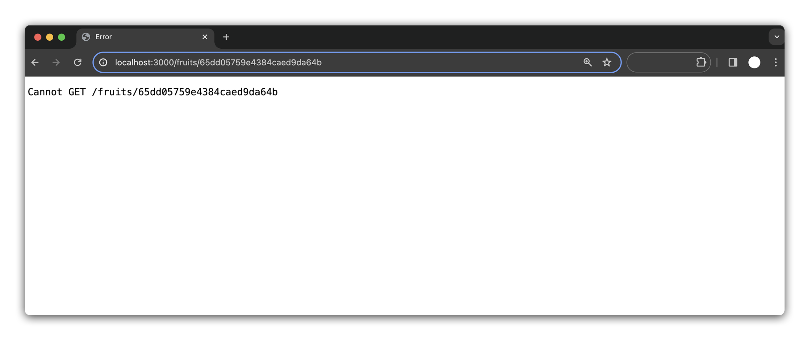
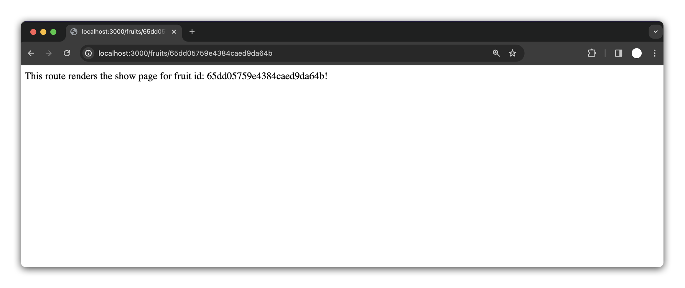
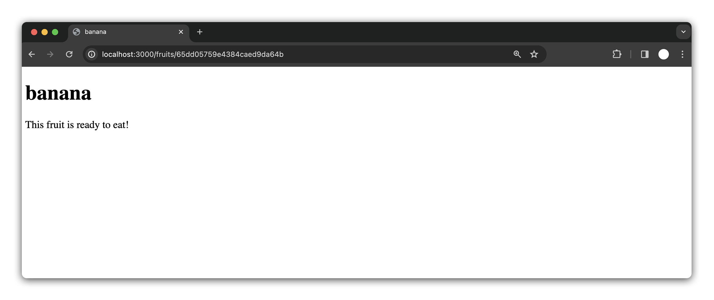

<h1>
  <span class="headline">Fruits</span>
  <span class="subhead">Build the Fruits Show Page</span>
</h1>

**Learning objective:** By the end of this lesson, students will be able to create and implement a `show` route in Express that displays detailed information about a specific item from a database.

## The `show` route

The show route is designed to display detailed information about a specific item, such as a specific `fruit` in our application. In keeping with RESTful routing conventions, the `url` for this route will be: `/fruits/:id`. 

Because `:id` is just a placeholder, we can be more specific in the case of this app and go with `/fruits/:fruitId`.

The `:fruitId` in the URL is a variable segment, known as a URL parameter. It allows our route to dynamically handle requests for different fruits by their unique `ID`s. So, whenever a user wants to view details about a particular fruit, they will navigate to a URL like `/fruits/12345`, where `12345` is the fruit's `ID`.

## Link to the route

To create a way for users to view more details about an individual fruit, we'll transform the fruit names listed on the app's `index` page into clickable links. This will allow users to navigate to the `show` page for each fruit. Currently, our `index.ejs` template displays a list of fruits, but they aren't interactive. 

Here is our current `index` page code:

```html
<!-- views/fruits/index.ejs -->

<body>
  <h1>All Fruits</h1>
<ul>
  <% fruits.forEach(fruit => { %>
    <li><%= fruit.name %></li>
  <% }); %>
</ul>
</body>
```

To make each fruit name a clickable link, we'll wrap the `<%= fruit.name %>` with an `<a>` tag. The `href` attribute of each link will point to the show route of the corresponding fruit. We'll use the fruit's `ID` to build this URL.

Lets update the code and wrap each fruit item in a link:

```html
<!-- views/fruits/index.ejs -->

<body>
  <h1>All Fruits</h1>
  <ul>
    <% fruits.forEach(fruit => { %>
      <li><a href="#"><%= fruit.name %></a></li>
    <% }); %>
  </ul>
</body>
```

### Adding a dynamic `href`

As we iterate through the fruit objects, we already access their names using `fruit.name`. We can do the same for its `id`. Looking back at when we logged our data to the console, we saw:


Utilizing `_id` will give us the `id` that we need. Now we can make the adjustment to the `<a>` tag and add a dynamic `href`.

```html
<!-- views/fruits/index.ejs -->

<body>
  <h1>All Fruits</h1>
  <ul>
    <% fruits.forEach(fruit => { %>
      <li>
        <a href="/fruits/<%= fruit._id %>"> <%= fruit.name %> </a>
      </li>
    <% }); %>
  </ul>
</body>
```

In this updated code, each fruit name is now a link. When clicked, it will take the user to the `show` page for that specific fruit, using its unique `ID` in the URL.

The items should now render as links in the browser:



Let's test a link. Uh-oh! Error!



Looks like this route does not exist. Which makes sense, we haven't built it yet. Let's get started. 

## Define the route

Let's define and test our `show` route.

Add the following rote to `server.js`, ***below*** the `fruits/new` route:

```js
app.get("/fruits/:fruitId", (req, res) => {
  res.send(
    `This route renders the show page for fruit id: ${req.params.fruitId}!`
  );
});
```

Test your new route in the browser.

You should see your message along with our `fruitId` route parameter. 



### A note on route order

The order in which routes are placed in an express server is important, as Express evaluates them top-to-bottom. This means the placement of routes can affect how your application responds to specific URLs.

As an experiment, temporarily move your `/fruits/:fruitId` route above your `fruits/new` route. Now navigate to your new fruit page. What happened?

The issue arises because Express matches routes in the order they are defined. The URL `/fruits/new` is mistakenly caught by the `/fruits/:fruitId` route. In this route, `:fruitId` acts as a placeholder and accepts any string, including "new". So, Express thinks "new" is a fruit ID and stops looking for further route matches.

To resolve this, we need to ensure that any route with an  `/:id`  is placed after `/new` in our express applications. 

## Build the `read` functionality

We'll use Mongoose's `.findById()` method for fetching a specific fruit by its `_id`. This method is perfect for retrieving a single document based on its unique identifier.

Update the route with the following:

```js
app.get("/fruits/:fruitId", async (req, res) => {
  const foundFruit = await Fruit.findById(req.params.fruitId);
  res.send(`This route renders the show page for fruit id: ${req.params.fruitId}!`);
});
```

In the above code, `req.params.fruitId` captures the ID from the URL, and we use it to find the specific fruit. We've also made the function `async` so that we can `await` the asynchronous database operation.


## Rendering the Fruit details

After fetching the fruit, we'll update from `res.send()` to `res.render()` to display the show page template. We'll also pass the retrieved `fruit` data to the template:

```js
app.get("/fruits/:fruitId", async (req, res) => {
  const foundFruit = await Fruit.findById(req.params.fruitId);
  res.render("fruits/show.ejs", { fruit: foundFruit });
});
```

If you test the route, you'll see a familiar error. We need a `show` page. 


## Create the `show` template

Now that the route is set up, let's create the template. Create a `show.ejs` template inside the `views/fruits`:

```bash
touch views/fruits/show.ejs
```

Add the following HTML boilerplate to `show.ejs`:

```html
<!DOCTYPE html>
<html lang="en">
  <head>
    <meta charset="UTF-8" />
    <meta name="viewport" content="width=device-width, initial-scale=1.0" />
    <title>Fruit Show Page</title>
  </head>
  <body>
    <h1>Here Is Your Fruit</h1>
  </body>
</html>
```

Refresh your browser to see a rendered page.

Let's enhance our application to show detailed information about each fruit. We'll achieve this by dynamically updating our HTML template using the `fruit` data we've passed.

```html
<!-- views/fruits/show.ejs -->

<!DOCTYPE html>
<html lang="en">
  <head>
    <meta charset="UTF-8" />
    <meta name="viewport" content="width=device-width, initial-scale=1.0" />
    <title><%= fruit.name %></title> <!-- Dynamic title based on fruit name -->
  </head>
  <body>
    <h1><%= fruit.name %></h1> <!-- Display fruit name -->
    <!-- Add more details about the fruit here -->
  </body>
</html>
```

Refresh or click on a specific fruit on our `index` page, and our `show` page should be more specific.

To enhance our fruit details page, we'll incorporate conditional rendering based on the fruit's `isReadyToEat` property. This will display different messages depending on whether the fruit is ready to eat or not.

We'll use EJS control flow to dynamically display a message about the fruit's readiness. Insert an `if/else` statement in the HTML body, right after the `<h1>` tag:

```html
<<!-- views/fruits/show.ejs -->

<body>
  <h1><%= fruit.name %></h1>
  <!-- Conditional rendering based on fruit's readiness -->
  <% if (fruit.isReadyToEat) { %>
    <p>This fruit is ready to eat!</p>
  <% } else { %>
    <p>This fruit is not ready to eat!</p>
  <% } %>
</body>
```

With this code, our application checks the `isReadyToEat` property of the fruit. If it's true, it displays "This fruit is ready to eat!" Otherwise, it shows "This fruit is not ready to eat!"



## Link `show` page back to Fruits `index`

Now that we've viewed a specific fruit, let's say we want to look at the details of another fruit. We'll need to navigate back to the `index` page.

Add the following to the fruit `show` page:

```html
<a href="/fruits/">Back to Fruits</a>
```

Test your link! 

With a working show page, you have successfully performed your next CRUD operation, **Read**. Congrats!
