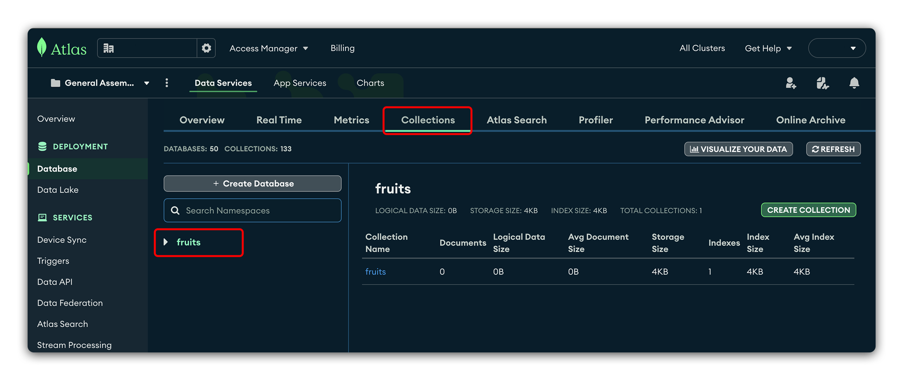
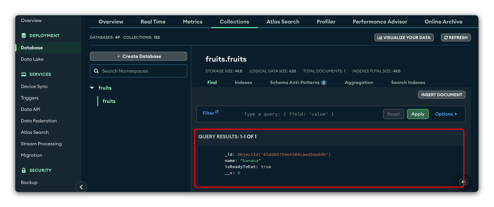

<h1>
  <span class="headline">Fruits</span>
  <span class="subhead">Create a Fruit</span>
</h1>

**Learning objective:** By the end of this lesson, students will be able to create a route that will receive the submission of the form in `/fruits/new`. This route will create a fruit document in the `fruits` collection in their MongoDB Atlas database.

## The `create` Route

In this section, we will develop a route to handle form submissions for creating new fruits in our database. The route will be `POST /fruits`, following RESTful conventions where `POST` signifies the creation of new data.

When a user submits the form on the `/fruits/new` page, the browser sends a request to our server with the form data. To access this data in Express, we need to use middleware. Specifically, we'll use `express.urlencoded`. This middleware parses incoming request bodies, extracting form data and converting it into a JavaScript object. It then attaches this object to the `req.body` property of the request, making the form data easily accessible within our route handlers.

To enable this functionality, add the following line to `server.js`, right after importing the `Fruit` model:

```javascript
app.use(express.urlencoded({ extended: false }));
```

> Remember, `app.use` allows us to plug additional functionality into express. It basically extends the capabilities of our app.

## Define the route

Let's start by defining and testing our route. Add the following code to `server.js`, beneath the `new` route:

```javascript
// server.js

// POST /fruits
app.post("/fruits", async (req, res) => {
  console.log(req.body);
  res.redirect("/fruits/new");
});
```

In the browser, enter some data and submit the form on the `/fruits/new` page. You'll instantly be redirected back to `/fruits/new`, but if you check your terminal, you should see a JS object representation of the form data you just submitted.

## Build the `create` functionality

Now that we've confirmed our form submits data to the `POST` route, let's add the logic to create a `fruit` in our database:

```javascript
// server.js

// POST /fruits
app.post("/fruits", async (req, res) => {
  if (req.body.isReadyToEat === "on") {
    req.body.isReadyToEat = true;
  } else {
    req.body.isReadyToEat = false;
  }
  await Fruit.create(req.body);
  res.redirect("/fruits/new");
});
```

In the code snippet above, we have to do a little bit of data manipulation before our new fruit is ready to be sent to the database. The `if` statement checks the value of `req.body.isReadyToEat`. This field comes from a checkbox in our form. In web forms, a checked checkbox sends the value `"on"`, while an unchecked checkbox sends no value (thus, it's undefined). We convert this "on" or undefined value to a Boolean (true or false) to match our schema's expected data type for `isReadyToEat`.

Next, we use `Fruit.create(req.body)` to add a new `fruit` to our database. `req.body` contains the form data sent by the user, which now includes our corrected `isReadyToEat` value. `Fruit.create()` is an asynchronous operation; we use `await` to ensure the database operation completes before the function continues.

Finally, we redirect the user back to the form page using `res.redirect("/fruits/new")`. This is a common practice after processing form data to prevent users from accidentally submitting the form multiple times by refreshing the page.

Let's verify our data was saved by navigating to our MongoDB Atlas dashboard. Once in the dashboard, click on the "Collections" section for your database.



You should see a collection called "fruits". Click on that collection and see if you can find the document of your newly created fruit.



If you can see your newly created fruit, you have successfully performed your first CRUD operation, **Create**. Congrats!